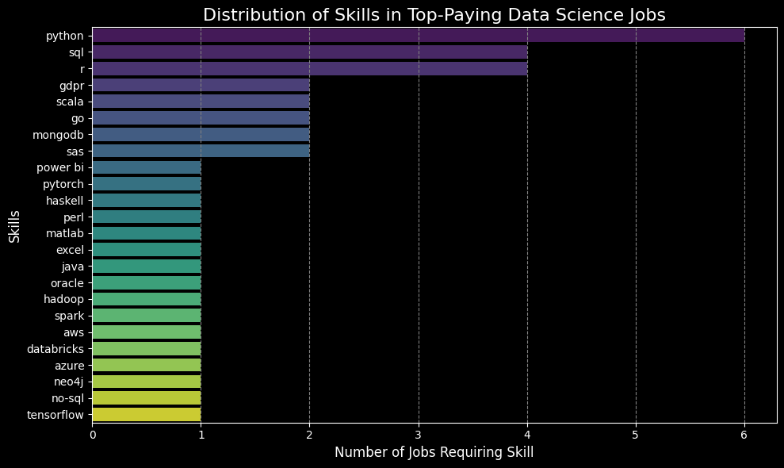
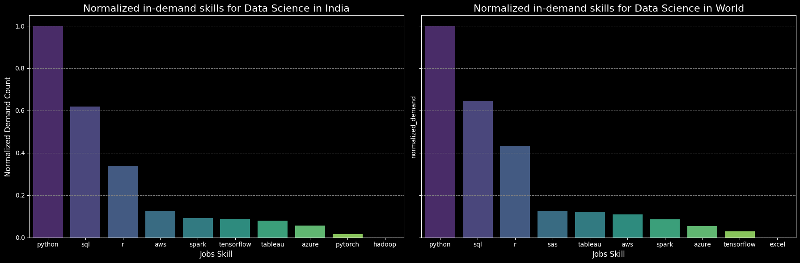

# Introduction
🚀 Welcome to the AI Era: A Graduate's Job Market Adventure! 🎓

Dive 📊 into the data job market! Focusing on data science roles, this project explores 💰 top-paying jobs, 🔥 in-demand skills, and 📈 where high demand meets high salary in the field of data science.

🔍 The Questions I solved? Check them out here: [Project Folder](/sql_project/)

# Motivation
Ever felt like you're on a rollercoaster 🎢 in this unpredictable job market? Trust me, you're not alone! 😅 As a fresh grad, I've been asking myself questions like:

- 🤔 Are my skills still hot in the industry?
- 📚 What new abilities should I be focusing on?
- 🔍 How can I break into my dream field and land that first job?

Instead of drowning in questions, I decided to take action! 💪 Like any curious grad out there, I dove into some serious market research and analysis. The result? This eye-opening project that not only answered my burning questions but might just solve some of yours too! 🌟

So, buckle up and join me on this data-driven journey through the job market jungle. Who knows? You might just find the career compass you've been looking for! 🧭✨
## The questions I wanted to answer:
- What are the top-paying Job roles in the field of Data Science?
- What skills are required for these top-paying roles? (specially in my desired location)
- What are some In-Demand Skills for data science jobs? (India Vs Global)
- What are the Skills that can help to gain higher salary?
- What are the most 'optimal' skills to learn to stay on top?
# Tools I've Used
- **SQL**: The foundation of my study, which enables me to search the database and uncover important information.
- **PostgreSQL**: The chosen database management system, ideal for handling the job posting data.
- **Visual Studio Code**: My go-to IDE for database management, executing SQL queries and others
- **Git & GitHub**: Essential for version control and sharing my SQL scripts and analysis, ensuring collaboration and project tracking.
# Analysis
 ### **Skill Diversity**:
- There's a high diversity in job titles, from Data Analyst to Geographic Information Systems Analyst to VP of Data Science & Research, reflecting varied roles and specializations within the field of Data Science.
### **Skill Insights Summary**:
- Python, SQL, and R are foundational skills for data scientists, required across the board.
- Cloud platforms (AWS, Azure) and big data tools (Spark, Hadoop) are vital for scaling data processing workflows.
- Machine learning frameworks (PyTorch, TensorFlow) show strong demand for AI/ML capabilities.
- Niche tools like SAS, MATLAB, and Haskell highlight specialized needs, especially in research-intensive fields.
- Knowledge of NoSQL databases and privacy regulations (like GDPR) is increasingly necessary, particularly for data architects and research scientists.

### **Key Observations on In-Demand Skills**:

- **Python and SQL are universally critical**: Both in India and globally, Python and SQL are the top two skills. Their dominance highlights that programming and database querying are essential for any data science role, regardless of region.
- **R is more important globally**: The normalized demand for R is higher globally than in India, indicating that R is more critical on the global stage. This could be due to the prevalence of industries such as academia, healthcare, and finance, where R is widely used.
- **SAS is more prominent globally**: SAS ranks fourth globally, but it doesn't even appear in India's top 10. This suggests that SAS has become more regionally specialized and less relevant in India's job market.
- **Cloud and Big Data Skills (AWS and Spark)**: AWS and Spark are in demand both globally and in India, though their normalized demand is quite similar across regions. This reflects the growing importance of cloud computing and big data technologies for data scientists worldwide.
- **India prioritizes TensorFlow more than the world**: TensorFlow appears more prominently in India's top skills than globally. This suggests that deep learning technologies, especially TensorFlow, are gaining ground in the Indian market, perhaps due to the rise of AI and machine learning startups.
- **Excel vs. Tableau**: Tableau is present in both markets but has slightly higher demand globally than in India.Interestingly, Excel has no significant demand globally in this dataset, possibly indicating that companies are transitioning to more advanced tools for data analysis and reporting.
- **PyTorch and Hadoop in India**: PyTorch is a deep learning tool that makes the top 10 list in India, indicating that it is an emerging skill in the Indian market, even though its demand is still low.Hadoop, once a dominant big data technology, is now virtually obsolete in India's data science job market, with Spark taking the lead.

### **Summary of Trends Globally vs India**:
- #### Globally
    - High-paying jobs are not just about traditional data science skills but increasingly about specialized frameworks, tools, and cloud platforms.
   - Project management, collaboration, and workflow tools like Asana and Airtable have emerged as essential, especially with the rise of remote work.
   - Niche programming languages and specialized cloud databases (e.g., Neo4j, DynamoDB) command premium salaries, reflecting the need for expertise in specific technical areas.
   - AI and machine learning frameworks are crucial, with frameworks like PyTorch, Theano, and Watson offering some of the highest-paying opportunities in the field.
   #### Professionals with proficiency in these skills are highly sought after and compensated accordingly, reflecting the dynamic and evolving needs of the global data science industry.

- #### India 
    - Full-stack development and automation testing frameworks are highly valued, showing the growing integration of data science with web development and software testing.
    - Data analytics and BI tools (e.g., Cognos, DAX, Looker) reflect the increasing need for skilled professionals who can generate insights from data and visualize it for decision-makers.
    - Cloud data warehousing tools like Snowflake and strong SQL skills are critical for handling arge-scale datasets in cloud environments.
    - AI, machine learning, and NLP tools continue to be crucial, with skills in frameworks like PyTorch, Scikit-learn, and NLTK ranking high in terms of salary
    - MLOps and DevOps skills are rising, with demand for professionals who can deploy machine learning models at scale using tools like Docker, Kubernetes, and GitLab.
    #### These trends show that companies in India are investing in professionals with specialized skills in both traditional and emerging data science technologies.
- #### Final Thoughts
    1) Higher Valuation of Niche Tools Globally (Asana, Airtable, and Neo4j)
    2) Cloud Technologies Demand in Both Regions (AWS, Azure, and Snowflake)
    3) Machine Learning and AI Frameworks are Key in Both Markets (PyTorch, Scikit-learn, and TensorFlow)
    4) Emphasis on DevOps & MLOps in India (GitLab, Kubernetes, and Docker)
    5) Global Market Pays Premium for Collaboration and Productivity Tools (Slack, Notion, and Zoom)

### **Most Optimal Skills to Learn Globally vs India**:
-  **High-Demand Programming Languages**
    - **Global**: GO, Python
    - **India**: Python, R, Java, Scala
- **Data Engineering Tools**
    - **Global**: Apache Airflow, Cassandra, Spark, BigQuery
    - **India**: Spark, Hadoop
- **ML & DL Frameworks**
    - **Global**: PyTorch, Hugging Face, Theano, Keras
    - **India**: PyTorch, TensorFlow, Keras  
- **Data Visualization & Business Intelligence Tools**
    - **Global**: Looker
    - **India**: Tableau, Power BI, Excel  
- **Cloud Platforms**
    - **Global**: AWS
    - **India**: Azure, AWS    
- **Database Technologies**
    - **Global**: Neo4j, DynamoDB, Cassandra 
    - **India**: SQL, Oracle 

### Key Insights:
- **Global vs India**:
    - **Global** trends focus more on advanced frameworks like Hugging Face, Theano, and niche database tools like Neo4j, with higher average salaries.
    - **In India**, traditional skills like Python, SQL, and Spark remain highly in demand, but with significantly lower salary figures compared to global standards.
- **Framework Focus**: PyTorch and TensorFlow are in demand both globally and in India, but global salaries are much higher.

# Things I've Learned
- **🔍 Advanced Query Construction**: Developed expertise in complex SQL, including sophisticated table joins and efficient use of WITH clauses for temporary table operations.
- **📊 Effective Data Summarization**: Mastered JOINS, the use of GROUP BY statements and aggregate functions such as COUNT() and AVG() for comprehensive data analysis.
- **💡Applied Analytical Skills**: Enhanced problem-solving abilities by translating business questions into precise, informative SQL queries.
# Conclusions
In the rapidly evolving field of data science, it's clear that **Python** and **SQL** remain the cornerstone skills both globally and in India. However, 
the landscape is shifting, with specialized tools and frameworks like **PyTorch**, **TensorFlow**, and **AWS** becoming more prominent in India, while globally, 
there's a strong emphasis on niche technologies like **Hugging Face**, **Neo4j**, and **Theano**.

### Key Takeaways:
- **Skill Focus**: Master Python, SQL, and cloud platforms while expanding into machine learning frameworks and MLOps tools like **Docker** and **Kubernetes**.
- **India vs Global**: Globally, niche tools (e.g., **Hugging Face, Neo4j**) command higher salaries, while in India, foundational skills still dominate, though deep learning and cloud tech are rising fast.
- **Salary Insights**: While salaries in India are generally lower than global standards, skills like **PyTorch, TensorFlow**, and **cloud platforms** still offer competitive compensation, especially as AI and machine learning gain prominence.
- **Emerging Trend**: Both markets are prioritizing **cloud technologies, machine learning frameworks**, and **data visualization tools**. India, however, shows a growing interest in **MLOps** and **DevOps** skills, which are becoming essential for deploying machine learning models at scale.

# Final Thoughts
For a fresh graduate, building a solid foundation in Python and SQL is key, but mastering advanced tools like PyTorch, TensorFlow, and cloud platforms will open doors to higher-paying roles and greater opportunities, especially in India’s rapidly advancing tech landscape. Stay curious, adapt, and keep learning to stay on top in the AI era. 🌟

## Shout-Out
Special thanks to **Luke Barousse** for generously providing the dataset! 🙌 He’s an amazing **YouTuber** who shares tons of valuable insights about data science and beyond. Make sure to check out his channel [Luke's Channel](https://www.youtube.com/@LukeBarousse)for top-notch tutorials and tips to level up your data skills! 📊🚀